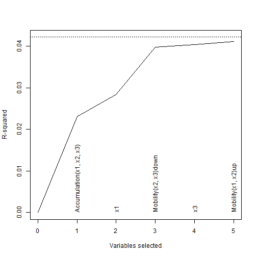
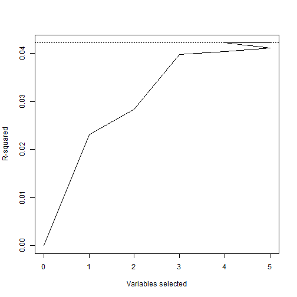
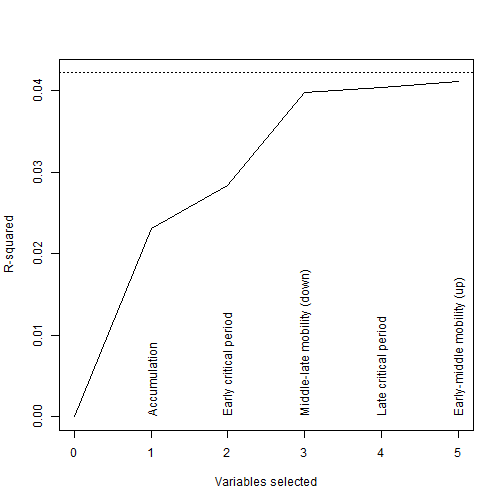
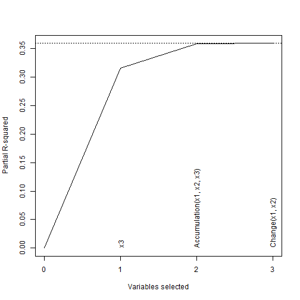
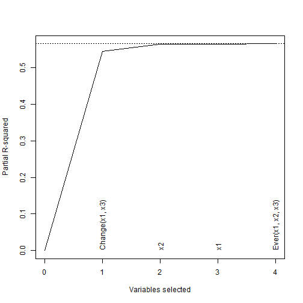

## Getting started

Load the library.


```r
library(slcma)
```

## Example 1. SLCMA

Generate some data that matches that seen in Mishra et al (2009).
This is the code I supplied in my 2015 Epidemiology paper.


```r
N <- c(141,20,88,80,40,35,317,367)
BMI <- c(28.7,27.5,29.1,27.8,28.3,27.1,27.6,26.0)
SE <- c(0.5,1.1,0.7,0.7,0.8,0.9,0.3,0.2)
S1 <- c(0,1,0,0,1,1,0,1)
S2 <- c(0,0,1,0,1,0,1,1)
S3 <- c(0,0,0,1,0,1,1,1)
x1 <- rep(S1,N)
x2 <- rep(S2,N)
x3 <- rep(S3,N)
epsilon <- rnorm(sum(N))
e <- lm(epsilon ~ x1 * x2 * x3)$residuals
y <- rep(BMI,N) + rep(SE*sqrt(N),N) * e/sd(e)
```

As in my 2015 Epidemiology paper, perform SLCMA with 3 critical periods (early, middle, late)

* Accumulation

* Early-middle mobility (up and down)

* Middle-late mobility (up and down)

## LARS (stage 1)


```r
myslcma <-
  slcma(y ~ x1 + x2 + x3 + Accumulation(x1,x2,x3) + Mobility(x1,x2) + Mobility(x2,x3))
```

```
##                      Term                             Role
##               (Intercept)       Adjusted for in all models
##                        x1 Available for variable selection
##                        x2 Available for variable selection
##                        x3 Available for variable selection
##  Accumulation(x1, x2, x3) Available for variable selection
##        Mobility(x1, x2)up Available for variable selection
##      Mobility(x1, x2)down Available for variable selection
##        Mobility(x2, x3)up Available for variable selection
##      Mobility(x2, x3)down Available for variable selection
```

Get a summary of the SLMCA, to see what variables are added at which stage.
This is more meaningful that the usual output of lars.


```r
summary(myslcma)
```

```
## 
## Summary of LARS procedure
##  Step        Variable selected Variable removed Variables R-squared
##     0                                                   0     0.000
##     1 Accumulation(x1, x2, x3)                          1     0.023
##     2                       x1                          2     0.028
##     3     Mobility(x2, x3)down                          3     0.039
##     4                       x3                          4     0.040
##     5       Mobility(x1, x2)up                          5     0.040
##     6                                        x3         4     0.042
##     7     Mobility(x1, x2)down                          5     0.042
```

## Elbow plots

Default plot

```r
plot(myslcma)
```



For diagnostic purposes, 
can also show the part of the elbow plot after variables get removed and others added in.


```r
plot(myslcma, show.remove=TRUE, show.labels=FALSE)
```



Sometimes it is more helpful to show
an alternative elbow plot with the R2 from the relaxed lasso.


```r
plot(myslcma, relax=TRUE)
```


Can add your own labels to the elbow plot

```r
plot(myslcma, labels = c("Early critical period","Middle critical period","Late critical period",
                         "Accumulation","Early-middle mobility (up)","Early-middle mobility (down)",
                         "Middle-late mobility (up)", "Middle-late mobility (down)"))
```

```
##                         Label                     Term
##         Early critical period                       x1
##        Middle critical period                       x2
##          Late critical period                       x3
##                  Accumulation Accumulation(x1, x2, x3)
##    Early-middle mobility (up)       Mobility(x1, x2)up
##  Early-middle mobility (down)     Mobility(x1, x2)down
##     Middle-late mobility (up)       Mobility(x2, x3)up
##   Middle-late mobility (down)     Mobility(x2, x3)down
```


Or if you can't remember all the variable names,
and just want to label the ones that appear on the plot.

```r
plot(myslcma, labels = c("Accumulation","Early critical period","Middle-late mobility (down)",
                         "Late critical period", "Early-middle mobility (up)"), selection.order=TRUE)
```

```
##                        Label                     Term
##                 Accumulation Accumulation(x1, x2, x3)
##        Early critical period                       x1
##  Middle-late mobility (down)     Mobility(x2, x3)down
##         Late critical period                       x3
##   Early-middle mobility (up)       Mobility(x1, x2)up
##                           x3                       x3
##         Mobility(x1, x2)down     Mobility(x1, x2)down
```



The function provides a sanity check so you can compare the default labels with the user-defined labels.

## Inference (stage 2)

Maybe there is an elbow at Step 3, perform selective inference by default

```r
slcmaInfer(myslcma, 3)
```

```
## Warning in lsfit(x, y, intercept = oo): 'X' matrix was collinear
```

```
## 
## Inference for model at Step 3 of LARS procedure
## 
## Number of selected variables: 3
## R-squared from lasso fit: 0.039
## 
## Results from fixed lasso inference (selective inference):
## 
## Standard deviation of noise (specified or estimated) sigma = 5.174
## 
## Testing results at lambda = 5.553, with alpha = 0.050
## 
##                            Coef P-value  CI.lo  CI.up LoTailArea UpTailArea
## x1                       -0.778   0.151 -1.693  0.811      0.025      0.025
## Accumulation(x1, x2, x3) -0.608   0.010 -1.229 -0.110      0.025      0.025
## Mobility(x2, x3)down      1.196   0.047 -0.251  2.184      0.025      0.024
```

We have the option to report the results of the relaxed lasso instead

```r
slcmaInfer(myslcma, 3, method="relax")
```

```
## 
## Inference for model at Step 3 of LARS procedure
## 
## Number of selected variables: 3
## R-squared from lasso fit: 0.039
## 
## Results from relaxed lasso:
## 
## R-squared from relaxed lasso fit: 0.041
## 
##                                Coef        SE      CI.lo      CI.up
## x1                       -0.7781529 0.4589122 -1.6776043  0.1212986
## Accumulation(x1, x2, x3) -0.6082188 0.2292086 -1.0574593 -0.1589783
## Mobility(x2, x3)down      1.1962127 0.5005332  0.2151856  2.1772398
```

We have the option of trying the max-|t| test, but only at Step 1.


```r
slcmaInfer(myslcma, 1, method="maxt")
```

```
## 
## Inference for model at Step 1 of LARS procedure
## 
## Number of selected variables: 1
## R-squared from lasso fit: 0.023
## 
## Results from max-|t| test:
## 
## Error standard deviation: 5.167 on 1082 degrees of freedom
## 
##                                Coef      P-value
## Accumulation(x1, x2, x3) -0.9641575 3.677438e-09
## 
## Message regarding calculation of P-value: Normal Completion
##  with estimated numeric absolute error: 1.746332e-09
```

We can also get confidence intervals from the max-|t| test, 
but these are time-consuming so they are not produced by default

```r
slcmaInfer(myslcma, 1, method="maxt", do.maxtCI=TRUE)
```

```
## 
## Inference for model at Step 1 of LARS procedure
## 
## Number of selected variables: 1
## R-squared from lasso fit: 0.023
## 
## Results from max-|t| test:
## 
## Error standard deviation: 5.167 on 1082 degrees of freedom
## Confidence interval coverage 95.0 percent
## 
##                                Coef      P-value     CI.lo      CI.up
## Accumulation(x1, x2, x3) -0.9641575 3.677438e-09 -1.311416 -0.6442471
## 
## Message regarding calculation of P-value: Normal Completion
##  with estimated numeric absolute error: 1.746332e-09
```

We have the option of Bayesian inference,
to find the posterior probability of the first-selected variable being the most important

```r
slcmaInfer(myslcma, 1, method="Bayes")
```

```
## 
## Inference for model at Step 1 of LARS procedure
## 
## Number of selected variables: 1
## R-squared from lasso fit: 0.023
## 
## Posterior probabilities:
##                                    
## x1                       0.01341982
## x2                       0.00000035
## x3                       0.00211407
## Accumulation(x1, x2, x3) 0.98446365
## Mobility(x1, x2)up       0.00000023
## Mobility(x1, x2)down     0.00000000
## Mobility(x2, x3)up       0.00000000
## Mobility(x2, x3)down     0.00000187
```

It is possible to produce results for all inference methods

```r
slcmaInfer(myslcma, 1, method=c("selectiveInference","relax","maxt","Bayes"))
```

```
## Warning in lsfit(x, y, intercept = oo): 'X' matrix was collinear
```

```
## 
## Inference for model at Step 1 of LARS procedure
## 
## Number of selected variables: 1
## R-squared from lasso fit: 0.023
## 
## Results from fixed lasso inference (selective inference):
## 
## Standard deviation of noise (specified or estimated) sigma = 5.174
## 
## Testing results at lambda = 18.578, with alpha = 0.050
## 
##                            Coef P-value CI.lo  CI.up LoTailArea UpTailArea
## Accumulation(x1, x2, x3) -0.964       0 -1.27 -0.636      0.025      0.025
## 
## Results from max-|t| test:
## 
## Error standard deviation: 5.167 on 1082 degrees of freedom
## 
##                                Coef      P-value
## Accumulation(x1, x2, x3) -0.9641575 3.677438e-09
## 
## Message regarding calculation of P-value: Normal Completion
##  with estimated numeric absolute error: 1.746332e-09
## 
## Results from relaxed lasso:
## 
## R-squared from relaxed lasso fit: 0.034
## 
##                                Coef        SE     CI.lo      CI.up
## Accumulation(x1, x2, x3) -0.9641575 0.1551334 -1.268213 -0.6601015
## 
## Posterior probabilities:
##                                    
## x1                       0.01341982
## x2                       0.00000035
## x3                       0.00211407
## Accumulation(x1, x2, x3) 0.98446365
## Mobility(x1, x2)up       0.00000023
## Mobility(x1, x2)down     0.00000000
## Mobility(x2, x3)up       0.00000000
## Mobility(x2, x3)down     0.00000187
```

## Example 2. Adjusting for covariates

Generate some data
(this is the code I supplied in my 2015 IJE paper).

```r
n <- 400
set.seed(1234)
covariate <- rnorm(n)
x1 <- covariate + rnorm(n)
x2 <- x1 + rnorm(n)
x3 <- x2 + 2*rnorm(n)
y <- 2*covariate + x3 + 3*rnorm(n)
```


## Adjust for covariates (stage 1)


Add any covariates into the formula,
then use the option adjust = a numeric vector containing the position(s) of covariate(s) in the formula.
Here there is one covariate (called 'covariate') and it is in the 8th position after the ~.
Hence adjust=8.


```r
slcmaAdjust <-
  slcma(y ~ x1 + x2 + x3 + Accumulation(x1,x2,x3) + Change(x1,x2) + Change(x2,x3) + Change(x1,x3) + covariate,
        adjust=8)
```

```
##                      Term                             Role
##               (Intercept)       Adjusted for in all models
##                        x1 Available for variable selection
##                        x2 Available for variable selection
##                        x3 Available for variable selection
##  Accumulation(x1, x2, x3) Available for variable selection
##            Change(x1, x2) Available for variable selection
##            Change(x2, x3) Available for variable selection
##            Change(x1, x3) Available for variable selection
##                 covariate       Adjusted for in all models
```

The function provides a sanity check so you can check the variables have the desired roles

You can revisit the sanity check

```r
slcmaAdjust$sanity
```

```
##                       Term                             Role
## 1              (Intercept)       Adjusted for in all models
## 2                       x1 Available for variable selection
## 3                       x2 Available for variable selection
## 4                       x3 Available for variable selection
## 5 Accumulation(x1, x2, x3) Available for variable selection
## 6           Change(x1, x2) Available for variable selection
## 7           Change(x2, x3) Available for variable selection
## 8           Change(x1, x3) Available for variable selection
## 9                covariate       Adjusted for in all models
```

Can summarize and produce plots as before

```r
summary(slcmaAdjust) 
```

```
## 
## Summary of LARS procedure
##  Step        Variable selected Variable removed Variables Partial R-squared
##     0                                                   0             0.000
##     1                       x3                          1             0.316
##     2 Accumulation(x1, x2, x3)                          2             0.359
##     3           Change(x1, x2)                          3             0.360
```

```r
plot(slcmaAdjust)
```



Can perform inference (stage 2) as before

```r
slcmaInfer(slcmaAdjust,1, method=c("selectiveInference","relax","maxt","Bayes"))
```

```
## Warning in lsfit(x, y, intercept = oo): 'X' matrix was collinear
```

```
## 
## Inference for model at Step 1 of LARS procedure
## 
## Number of selected variables: 1
## Partial R-squared from lasso fit: 0.316
##   Total R-squared from lasso fit: 0.594
## Adjusted for: covariate 
## 
## Results from fixed lasso inference (selective inference):
## 
## Standard deviation of noise (specified or estimated) sigma = 3.106
## 
## Testing results at lambda = 15.514, with alpha = 0.050
## 
##     Coef P-value CI.lo CI.up LoTailArea UpTailArea
## x3 0.964       0 0.835 1.093      0.024      0.024
## 
## Results from max-|t| test:
## 
## Error standard deviation: 3.094 on 395 degrees of freedom
## 
##         Coef P-value
## x3 0.9637339       0
## 
## Message regarding calculation of P-value: Normal Completion
##  with estimated numeric absolute error: 0.000000e+00
## 
## Results from relaxed lasso:
## 
## Partial R-squared from relaxed lasso fit: 0.357
##   Total R-squared from relaxed lasso fit: 0.618
## 
##         Coef         SE     CI.lo    CI.up
## x3 0.9637339 0.06493734 0.8364591 1.091009
## 
## Posterior probabilities:
##                                   
## x1                       0.0000000
## x2                       0.0000000
## x3                       0.9999993
## Accumulation(x1, x2, x3) 0.0000007
## Change(x1, x2)           0.0000000
## Change(x2, x3)           0.0000000
## Change(x1, x3)           0.0000000
```

## Example 3. Covariates and missing values

Some simulated data with missing values
(this is the code I supplied to The Dunn Lab in 2016)


```r
set.seed(123)
covariate <- rnorm(250)
x1 <- covariate + rnorm(250)
x2 <- x1 + 2*rnorm(250)
x3 <- x2 + 2*rnorm(250)
y <- 2*covariate + 2*(x3-x1) + 5*rnorm(250)
covariate[sample(1:250, size=10)] <- NA
x1[sample(1:250, size=10)] <- NA
x2[sample(1:250, size=10)] <- NA
x3[sample(1:250, size=10)] <- NA
y[sample(1:250, size=10)] <- NA
incompleteData <- data.frame(covariate,x1,x2,x3,y)
```

Complete case analysis

```r
CCslcma <- slcma(y ~ x1 + x2 + x3 + Accumulation(x1,x2,x3) + 
                 Change(x1,x3) + Ever(x1,x2,x3) + covariate, incompleteData, adjust=7)
```

```
##                      Term                             Role
##               (Intercept)       Adjusted for in all models
##                        x1 Available for variable selection
##                        x2 Available for variable selection
##                        x3 Available for variable selection
##  Accumulation(x1, x2, x3) Available for variable selection
##            Change(x1, x3) Available for variable selection
##          Ever(x1, x2, x3) Available for variable selection
##                 covariate       Adjusted for in all models
```

Impute missing values (5 imputated datasets to save time)

```r
imputedData <- mice(incompleteData, m=5, maxit=20, seed=321)
```

```
## 
##  iter imp variable
##   1   1  covariate  x1  x2  x3  y
##   1   2  covariate  x1  x2  x3  y
##   1   3  covariate  x1  x2  x3  y
##   1   4  covariate  x1  x2  x3  y
##   1   5  covariate  x1  x2  x3  y
##   2   1  covariate  x1  x2  x3  y
##   2   2  covariate  x1  x2  x3  y
##   2   3  covariate  x1  x2  x3  y
##   2   4  covariate  x1  x2  x3  y
##   2   5  covariate  x1  x2  x3  y
##   3   1  covariate  x1  x2  x3  y
##   3   2  covariate  x1  x2  x3  y
##   3   3  covariate  x1  x2  x3  y
##   3   4  covariate  x1  x2  x3  y
##   3   5  covariate  x1  x2  x3  y
##   4   1  covariate  x1  x2  x3  y
##   4   2  covariate  x1  x2  x3  y
##   4   3  covariate  x1  x2  x3  y
##   4   4  covariate  x1  x2  x3  y
##   4   5  covariate  x1  x2  x3  y
##   5   1  covariate  x1  x2  x3  y
##   5   2  covariate  x1  x2  x3  y
##   5   3  covariate  x1  x2  x3  y
##   5   4  covariate  x1  x2  x3  y
##   5   5  covariate  x1  x2  x3  y
##   6   1  covariate  x1  x2  x3  y
##   6   2  covariate  x1  x2  x3  y
##   6   3  covariate  x1  x2  x3  y
##   6   4  covariate  x1  x2  x3  y
##   6   5  covariate  x1  x2  x3  y
##   7   1  covariate  x1  x2  x3  y
##   7   2  covariate  x1  x2  x3  y
##   7   3  covariate  x1  x2  x3  y
##   7   4  covariate  x1  x2  x3  y
##   7   5  covariate  x1  x2  x3  y
##   8   1  covariate  x1  x2  x3  y
##   8   2  covariate  x1  x2  x3  y
##   8   3  covariate  x1  x2  x3  y
##   8   4  covariate  x1  x2  x3  y
##   8   5  covariate  x1  x2  x3  y
##   9   1  covariate  x1  x2  x3  y
##   9   2  covariate  x1  x2  x3  y
##   9   3  covariate  x1  x2  x3  y
##   9   4  covariate  x1  x2  x3  y
##   9   5  covariate  x1  x2  x3  y
##   10   1  covariate  x1  x2  x3  y
##   10   2  covariate  x1  x2  x3  y
##   10   3  covariate  x1  x2  x3  y
##   10   4  covariate  x1  x2  x3  y
##   10   5  covariate  x1  x2  x3  y
##   11   1  covariate  x1  x2  x3  y
##   11   2  covariate  x1  x2  x3  y
##   11   3  covariate  x1  x2  x3  y
##   11   4  covariate  x1  x2  x3  y
##   11   5  covariate  x1  x2  x3  y
##   12   1  covariate  x1  x2  x3  y
##   12   2  covariate  x1  x2  x3  y
##   12   3  covariate  x1  x2  x3  y
##   12   4  covariate  x1  x2  x3  y
##   12   5  covariate  x1  x2  x3  y
##   13   1  covariate  x1  x2  x3  y
##   13   2  covariate  x1  x2  x3  y
##   13   3  covariate  x1  x2  x3  y
##   13   4  covariate  x1  x2  x3  y
##   13   5  covariate  x1  x2  x3  y
##   14   1  covariate  x1  x2  x3  y
##   14   2  covariate  x1  x2  x3  y
##   14   3  covariate  x1  x2  x3  y
##   14   4  covariate  x1  x2  x3  y
##   14   5  covariate  x1  x2  x3  y
##   15   1  covariate  x1  x2  x3  y
##   15   2  covariate  x1  x2  x3  y
##   15   3  covariate  x1  x2  x3  y
##   15   4  covariate  x1  x2  x3  y
##   15   5  covariate  x1  x2  x3  y
##   16   1  covariate  x1  x2  x3  y
##   16   2  covariate  x1  x2  x3  y
##   16   3  covariate  x1  x2  x3  y
##   16   4  covariate  x1  x2  x3  y
##   16   5  covariate  x1  x2  x3  y
##   17   1  covariate  x1  x2  x3  y
##   17   2  covariate  x1  x2  x3  y
##   17   3  covariate  x1  x2  x3  y
##   17   4  covariate  x1  x2  x3  y
##   17   5  covariate  x1  x2  x3  y
##   18   1  covariate  x1  x2  x3  y
##   18   2  covariate  x1  x2  x3  y
##   18   3  covariate  x1  x2  x3  y
##   18   4  covariate  x1  x2  x3  y
##   18   5  covariate  x1  x2  x3  y
##   19   1  covariate  x1  x2  x3  y
##   19   2  covariate  x1  x2  x3  y
##   19   3  covariate  x1  x2  x3  y
##   19   4  covariate  x1  x2  x3  y
##   19   5  covariate  x1  x2  x3  y
##   20   1  covariate  x1  x2  x3  y
##   20   2  covariate  x1  x2  x3  y
##   20   3  covariate  x1  x2  x3  y
##   20   4  covariate  x1  x2  x3  y
##   20   5  covariate  x1  x2  x3  y
```

Apply LARS to data with same covariance structure as pooled data across imputations 
 (data created via Cholesky decomposition)
 

```r
MIslcma <- slcma(y ~ x1 + x2 + x3 + Accumulation(x1,x2,x3) + 
                 Change(x1,x3) + Ever(x1,x2,x3) + covariate, data=imputedData, adjust=7)
```

```
##                      Term                             Role
##               (Intercept)       Adjusted for in all models
##                        x1 Available for variable selection
##                        x2 Available for variable selection
##                        x3 Available for variable selection
##          Ever(x1, x2, x3) Available for variable selection
##                 covariate       Adjusted for in all models
##  Accumulation(x1, x2, x3) Available for variable selection
##            Change(x1, x3) Available for variable selection
```


Can summarize and produce plots as before

```r
summary(MIslcma) 
```

```
## 
## Summary of LARS procedure
##  Step Variable selected Variable removed Variables Partial R-squared
##     0                                            0             0.000
##     1    Change(x1, x3)                          1             0.544
##     2                x2                          2             0.564
##     3                x1                          3             0.565
##     4  Ever(x1, x2, x3)                          4             0.565
```

```r
plot(MIslcma)
```



Can perform inference (stage 2) as before

```r
slcmaInfer(MIslcma,1, method=c("selectiveInference","relax","maxt","Bayes"))
```

```
## Warning in lsfit(x, y, intercept = oo): 'X' matrix was collinear
```

```
## 
## Inference for model at Step 1 of LARS procedure
## 
## Number of selected variables: 1
## Partial R-squared from lasso fit: 0.544
##   Total R-squared from lasso fit: 0.570
## Adjusted for: covariate 
## 
## Results from fixed lasso inference (selective inference):
## 
## Standard deviation of noise (specified or estimated) sigma = 5.205
## 
## Testing results at lambda = 15.814, with alpha = 0.050
## 
##                 Coef P-value CI.lo CI.up LoTailArea UpTailArea
## Change(x1, x3) 2.027       0 1.801 2.252      0.024      0.025
## 
## Results from max-|t| test:
## 
## Error standard deviation: 5.195 on 244 degrees of freedom
## 
##                    Coef P-value
## Change(x1, x3) 2.026825       0
## 
## Message regarding calculation of P-value: Normal Completion
##  with estimated numeric absolute error: 0.000000e+00
## 
## Results from relaxed lasso:
## 
## Partial R-squared from relaxed lasso fit: 0.561
##   Total R-squared from relaxed lasso fit: 0.586
## 
##                    Coef        SE   CI.lo   CI.up
## Change(x1, x3) 2.026825 0.1142905 1.80282 2.25083
## 
## Posterior probabilities:
##                           
## x1                       0
## x2                       0
## x3                       0
## Ever(x1, x2, x3)         0
## Accumulation(x1, x2, x3) 0
## Change(x1, x3)           1
```

Can recreate the dummy dataset used within the above SLCMA

```r
myMIdata <- MI2dummy(y ~ x1 + x2 + x3 + Accumulation(x1,x2,x3) + 
                     Change(x1,x3) + Ever(x1,x2,x3) + covariate, imputedData)
```

Note how sums, sums of squares and cross products are the same for `Accumulation(x1,x2,x3)` and `x1+x2+x3`.


```r
sum(myMIdata$`Accumulation(x1, x2, x3)`)
```

```
## [1] 27.47647
```

```r
sum(myMIdata$x1+myMIdata$x2+myMIdata$x3)
```

```
## [1] 27.47647
```

```r
sum(myMIdata$`Accumulation(x1, x2, x3)`^2)
```

```
## [1] 8938.248
```

```r
sum((myMIdata$x1+myMIdata$x2+myMIdata$x3)^2)
```

```
## [1] 8938.248
```

```r
sum(myMIdata$x1 * myMIdata$`Accumulation(x1, x2, x3)`)
```

```
## [1] 1371.406
```

```r
sum(myMIdata$x1 * (myMIdata$x1+myMIdata$x2+myMIdata$x3))
```

```
## [1] 1371.406
```

```r
sum(myMIdata$y * myMIdata$`Accumulation(x1, x2, x3)`)
```

```
## [1] 7591.831
```

```r
sum(myMIdata$y * (myMIdata$x1+myMIdata$x2+myMIdata$x3))
```

```
## [1] 7591.831
```
